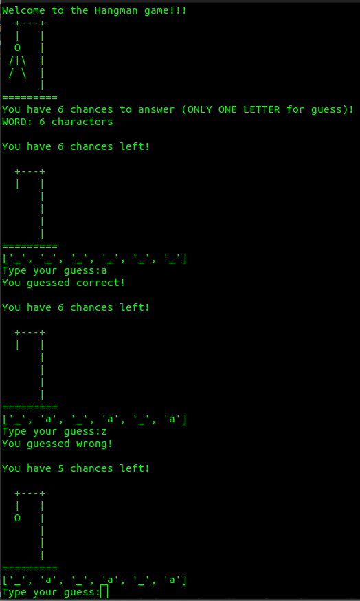

# hangmanForca

<h1>My first game and project while learning Python language.</h1>

<h2>In this project I was able to exercise loops, random, conditional statements, lists, strings, logical operators and much more.</h2>

<h2>Interface:</h2>

